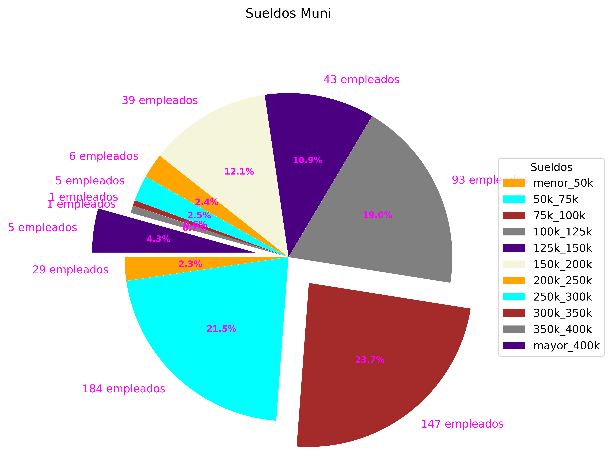

## Iber Ismael Piovani

# Pequeño ETL de web scraping

## Objetivo

Extraer datos de la web de la [Adolfo Gonzales Chaves sueldos de personal municipal](http://gonzaleschaves.gob.ar/sueldos-del-personal-municipal/sueldos-liquidos-julio-2022/) y cargarlos en un csv.

Tambien se realizo un pequeño analisis de los datos.

## Requerimientos

- Python 3.8
- [BeautifulSoup](https://www.crummy.com/software/BeautifulSoup/bs4/doc/)
- [Pandas](https://pandas.pydata.org/docs/)

## Uso

- Clonar el repositorio
- Instalar las dependencias
- Abrir sueldos_chaves.ipynb con jupyter notebook o similar.
- Ejecutar las celdas

## Resultados

- [Sueldos de personal municipal](graficos\sueldos.png)
  
- [Sueldos de personal municipal por intervalo salarial](graficos\sueldos_torta.png)
  

## Contacto

- [Linkedin](https://www.linkedin.com/in/iber-ismael-piovani-8b35bbba/)
- [Twitter](https://twitter.com/laimas)
- [Github](https://github.com/Vosinepi)

## Agradecimientos

- [Adolfo Gonzales Chaves](http://gonzaleschaves.gob.ar/)
- [Adolfo Gonzales Chaves sueldos de personal municipal](http://gonzaleschaves.gob.ar/sueldos-del-personal-municipal/sueldos-liquidos-julio-2022/)
